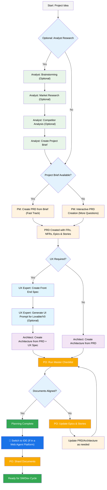
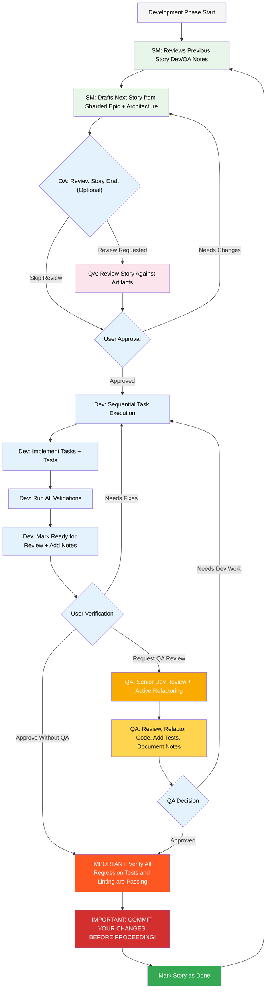

# BMad-Method BMAd 代码用户指南(BMad-Method BMAd Code User Guide)

本指南将帮助您理解并有效使用 BMad Method 进行敏捷 AI 驱动的规划和开发。

## BMad 规划和执行工作流(The BMad Plan and Execute Workflow)

首先，这是完整的标准 Greenfield 规划 + 执行工作流。Brownfield 非常相似，但建议先理解这个 greenfield，即使是在简单项目上，然后再处理 brownfield 项目。BMad Method 需要安装到您新项目文件夹的根目录。对于规划阶段，您可以选择使用强大的 web agents 来执行，可能会以比在某些 Agentic 工具中提供自己的 API 密钥或积分完成所需成本的一小部分获得更高质量的结果。对于规划，强大的思维模型和更大的上下文 - 以及与 agents 作为合作伙伴工作将获得最佳结果。

如果您要使用 BMad Method 处理 Brownfield 项目（现有项目），请查看 [在 Brownfield 中工作](./working-in-the-brownfield.md)

如果您看不到以下图表的渲染，可以在 VSCode（或其分支克隆之一）中安装 Markdown All in One 以及 Markdown Preview Mermaid Support 插件。使用这些插件，当打开时右键单击选项卡，应该有一个 Open Preview 选项，或查看 IDE 文档。

### 规划工作流(Web UI 或强大的 IDE Agents)(The Planning Workflow (Web UI or Powerful IDE Agents))

在开发开始之前，BMad 遵循结构化规划工作流，理想情况下在 web UI 中完成以提高成本效益：



#### Web UI 到 IDE 转换(Web UI to IDE Transition)

**关键转换点**：一旦 PO 确认文档对齐，您必须从 web UI 切换到 IDE 开始开发工作流：

1. **复制文档到项目**：确保 `docs/prd.md` 和 `docs/architecture.md` 在您项目的 docs 文件夹中（或您可以在安装期间指定的自定义位置）
2. **切换到 IDE**：在您首选的 Agentic IDE 中打开您的项目
3. **文档分片**：使用 PO agent 分片 PRD，然后分片 Architecture
4. **开始开发**：启动后续的核心开发周期

### 核心开发周期(IDE)(The Core Development Cycle (IDE))

一旦规划完成且文档已分片，BMad 遵循结构化开发工作流：



## 安装(Installation)

### 可选(Optional)

如果您想在 Web 中使用 Claude（Sonnet 4 或 Opus）、Gemini Gem（2.5 Pro）或 Custom GPT 进行规划：

1. 导航到 `dist/teams/`
2. 复制 `team-fullstack.txt` 内容
3. 创建新的 Gemini Gem 或 CustomGPT
4. 上传文件并附上说明："您的关键操作说明已附加，请按指示不要打破角色"
5. 输入 `/help` 查看可用命令

### IDE 项目设置(IDE Project Setup)

```bash
# 交互式安装（推荐）
npx bmad-method install
```

## 特殊 Agents(Special Agents)

有两个 bmad agents - 将来它们将合并到单个 bmad-master 中。

### BMad-Master

这个 agent 可以执行所有其他 agents 可以做的任何任务或命令，除了实际的故事实现。此外，这个 agent 可以通过访问知识库并在 web 中向您解释有关流程的任何内容来帮助解释 BMad Method。

如果您不想在 dev 之外切换不同的 agents，这就是适合您的 agent。

### BMad-Orchestrator

这个 agent 不应该在 IDE 中使用，它是一个重量级的特殊用途 agent，使用大量上下文并可以变形为任何其他 agent。它仅用于促进 web bundles 中的团队。如果您使用 web bundle，您将受到 BMad Orchestrator 的欢迎。

### Agents 如何工作(How Agents Work)

#### 依赖系统(Dependencies System)

每个 agent 都有一个 YAML 部分定义其依赖：

```yaml
dependencies:
    templates:
        - prd-template.md
        - user-story-template.md
    tasks:
        - create-doc.md
        - shard-doc.md
    data:
        - bmad-kb.md
```

**要点**：

- Agents 只加载它们需要的资源（精简上下文）
- 依赖在打包期间自动解析
- 资源在 agents 之间共享以保持一致性

#### Agent 交互(Agent Interaction)

**在 IDE 中**：

```bash
# 一些 IDE，如 Cursor 或 Windsurf 等，使用手动规则，因此交互使用 '@' 符号完成
@pm Create a PRD for a task management app
@architect Design the system architecture
@dev Implement the user authentication

# 一些，如 Claude Code 使用斜杠命令
/pm Create user stories
/dev Fix the login bug
```

#### 交互模式(Interactive Modes)

- **增量模式**：逐步进行，需要用户输入
- **YOLO 模式**：快速生成，交互最少

## IDE 集成(IDE Integration)

### IDE 最佳实践(IDE Best Practices)

- **上下文管理**：只在上下文中保留相关文件，保持文件尽可能精简和专注
- **Agent 选择**：为任务使用适当的 agent
- **迭代开发**：在小型、专注的任务中工作
- **文件组织**：维护干净的项目结构

## 技术偏好系统(Technical Preferences System)

BMad 通过位于 `.bmad-core/data/` 的 `technical-preferences.md` 文件包含个性化系统 - 这可以帮助偏向 PM 和 Architect 推荐您的设计模式、技术选择或您想要放在这里的任何其他内容的偏好。

### 与 Web Bundles 一起使用(Using with Web Bundles)

在创建自定义 web bundles 或上传到 AI 平台时，包含您的 `technical-preferences.md` 内容，以确保 agents 从任何对话开始就有您的偏好。

## 核心配置(Core Configuration)

`bmad-core/core-config.yaml` 文件是一个关键配置，使 BMad 能够与不同的项目结构无缝工作，未来将提供更多选项。目前最重要的是 yaml 中的 devLoadAlwaysFiles 列表部分。

### 开发者上下文文件(Developer Context Files)

定义 dev agent 应该始终加载的文件：

```yaml
devLoadAlwaysFiles:
    - docs/architecture/coding-standards.md
    - docs/architecture/tech-stack.md
    - docs/architecture/project-structure.md
```

您需要从分片架构中验证这些文档存在，它们尽可能精简，并包含您希望 dev agent 始终加载到其上下文中的确切信息。这些是 agent 将遵循的规则。

随着您的项目增长和代码开始建立一致的模式，编码标准应该减少到只是 agent 仍然会犯错误的项目 - 使用更好的模型，它们会查看文件中的周围代码，不需要该文件中的规则来指导它们。

## 获取帮助(Getting Help)

- **Discord 社区**：[加入 Discord](https://discord.gg/gk8jAdXWmj)
- **GitHub Issues**：[报告错误](https://github.com/bmadcode/bmad-method/issues)
- **文档**：[浏览文档](https://github.com/bmadcode/bmad-method/docs)
- **YouTube**：[BMadCode 频道](https://www.youtube.com/@BMadCode)

## 结论(Conclusion)

记住：BMad 旨在增强您的开发过程，而不是取代您的专业知识。将其用作加速项目的强大工具，同时保持对设计决策和实现细节的控制。
