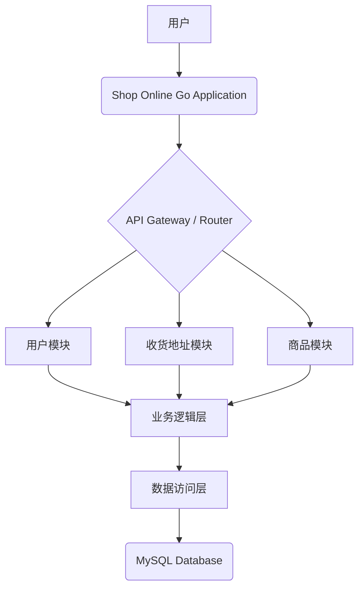
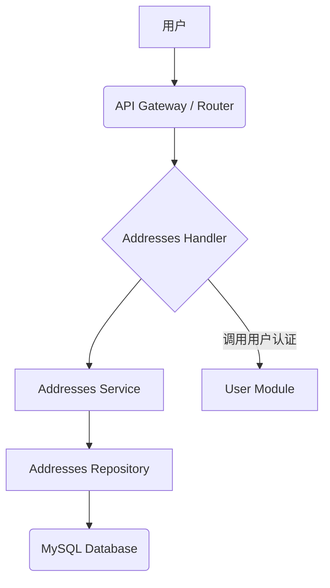
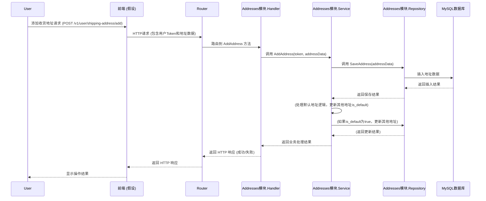

# 用户收货地址管理 Architecture Document

## Introduction

### Intro Content

This document outlines the overall project architecture for 用户收货地址管理, including backend systems, shared services, and non-UI specific concerns. Its primary goal is to serve as the guiding architectural blueprint for AI-driven development, ensuring consistency and adherence to chosen patterns and technologies.

**Relationship to Frontend Architecture:**
If the project includes a significant user interface, a separate Frontend Architecture Document will detail the frontend-specific design and MUST be used in conjunction with this document. Core technology stack choices documented herein (see "Tech Stack") are definitive for the entire project, including any frontend components.

### Starter Template or Existing Project

本项目是一个现有的棕地项目，我们正在对其进行增强。因此，我们没有使用新的启动模板。所有的架构设计将基于对现有代码库的分析和理解。

### Change Log

| Date | Version | Description | Author |
|---|---|---|---|---|
| 2025-07-25 | 1.0 | Initial draft of Architecture Document for User Shipping Address Management. | Winston |

## High Level Architecture

### Technical Summary

本项目采用模块化设计的单体应用架构，基于 Go 语言和 Gin 框架构建 RESTful API 服务。核心组件包括用户管理、收货地址管理（本次增强）、商品管理等，数据通过 GORM 持久化到 MySQL 数据库。此架构旨在提供稳定高效的后端服务，支持用户收货地址的全面管理，提升用户体验。

### High Level Overview

本项目采用单体应用架构，代码组织在一个单一的仓库中。服务架构遵循三层模式：表现层（Handler）、业务逻辑层（Service）和数据访问层（Repository）。用户通过 RESTful API 与应用程序交互，请求经过路由层分发到相应的业务模块，业务逻辑层协调数据访问层与 MySQL 数据库进行数据操作。关键的架构决策包括使用 GORM 作为 ORM 工具进行数据库交互，以及使用 Migrate 进行数据库版本管理。

### High Level Project Diagram



### Architectural and Design Patterns

*   **单体应用架构 (Monolith):** 整个应用程序作为一个单一的、紧密耦合的单元进行部署。
    *   _Rationale:_ 这是现有项目的架构风格，本次增强将继续遵循此模式，以最小化对现有系统的影响。
*   **分层架构 (Layered Architecture):** 应用程序逻辑分为表现层 (Handler)、业务逻辑层 (Service) 和数据访问层 (Repository)。
    *   _Rationale:_ 这是现有项目的代码组织模式，有助于职责分离和代码可维护性。
*   **仓储模式 (Repository Pattern):** 抽象数据访问逻辑，使业务逻辑层不直接依赖于特定的数据库实现。
    *   _Rationale:_ 现有项目已采用此模式，本次增强将继续遵循，便于测试和未来可能的数据库迁移。
*   **RESTful API:** 使用标准的 HTTP 方法和资源 URI 来设计 API 接口。
    *   _Rationale:_ 这是现有项目的 API 通信模式，确保新接口与现有接口的一致性。

## Tech Stack

### Technology Stack Table

| Category | Technology | Version | Purpose | Rationale |
|---|---|---|---|---|
| **Language** | Go | 1.17 | 后端开发语言 | 现有项目语言，高性能，并发支持 |
| **Web Framework** | Gin | v1.7.7 | 构建 RESTful API | 现有项目框架，轻量级，高性能 |
| **Configuration Management** | Viper | v1.11.0 | 读取和管理应用程序配置 | 现有项目配置方案，灵活 |
| **Database** | MySQL | (通过驱动推断) | 主要持久化存储 | 现有项目数据库，成熟稳定 |
| **MySQL Driver** | go-sql-driver/mysql | v1.6.0 | MySQL 数据库驱动 | GORM 底层使用 |
| **ORM** | GORM | v1.30.0 | 简化与 MySQL 数据库的交互 | 现有项目 ORM，功能强大 |
| **GORM MySQL Driver** | gorm.io/driver/mysql | v1.3.3 | GORM 的 MySQL 驱动 | 简化 GORM 与 MySQL 集成 |
| **Database Migration** | Migrate | v4.15.2 | 管理数据库版本和结构变更 | 现有项目迁移工具，自动化 |
| **Unique ID Generation** | xid | v1.4.0 | 生成全局唯一的 ID | 现有项目依赖，轻量级 |
| **Captcha Generation** | afocus/captcha | v0.0.0-20191010092841-4bd1f21c8868 | 生成图形验证码 | 现有项目依赖，特定功能 |
| **Operating System** | Ubuntu | 21 | 部署环境 | 现有项目操作系统 |

## Data Models

### Address

**Purpose:** 存储用户的收货地址信息，支持用户拥有多个地址并指定默认地址。

**Key Attributes:**
- `Id`: string - 地址唯一标识
- `UserId`: string - 关联的用户 ID
- `LinkMan`: string - 联系人姓名
- `Mobile`: string - 联系手机号
- `IsDefault`: bool - 是否为默认地址
- `ProvinceStr`: string - 省份
- `CityStr`: string - 城市
- `AreaStr`: string - 区域
- `DetailAddress`: string - 详细地址

**Relationships:**
- `Address` 与 `User` 之间存在一对多关系，一个用户可以有多个收货地址。

## Components

### Component List

*   **Addresses Module**
    *   **Responsibility:** 负责用户收货地址的增删改查（CRUD）业务逻辑和数据持久化。
    *   **Key Interfaces:**
        *   `addresses.Handler`: 暴露 RESTful API 接口供外部调用。
        *   `addresses.Service`: 提供业务逻辑方法供 Handler 调用。
        *   `addresses.Repository`: 提供数据访问方法供 Service 调用。
    *   **Dependencies:**
        *   `app/user` (用于用户认证和关联用户ID)
        *   `app/configs` (用于获取数据库配置)
        *   `gorm.io/gorm` (ORM 库)
        *   `github.com/gin-gonic/gin` (Web 框架)
    *   **Technology Stack:** Go, Gin, GORM, MySQL

*   **User Module** (现有模块，本次增强涉及其与 Addresses Module 的交互)
    *   **Responsibility:** 负责用户认证、用户详情管理等。
    *   **Key Interfaces:** 提供用户认证和获取用户 ID 的接口。
    *   **Dependencies:** (与 Addresses Module 无直接代码依赖，但有业务逻辑依赖)
    *   **Technology Stack:** Go, Gin, GORM, MySQL

### Component Diagrams



## External APIs

根据我们之前对 PRD 和项目现有文档的分析，本次用户收货地址功能的增强**不涉及新的外部 API 集成**。所有功能都将通过内部服务和数据库交互实现。

## Core Workflows



## REST API Spec

```yaml
openapi: 3.0.0
info:
  title: 用户收货地址管理 API
  version: 1.0.0
  description: 提供用户收货地址的增删改查功能。

servers:
  - url: http://localhost:9090/v1
    description: 本地开发服务器

paths:
  /user/shipping-address/add:
    post:
      summary: 添加用户收货地址
      operationId: addShippingAddress
      requestBody:
        required: true
        content:
          application/json:
            schema:
              $ref: '#/components/schemas/AddShippingAddressRequest'
      responses:
        '200':
          description: 成功添加收货地址
          content:
            application/json:
              schema:
                $ref: '#/components/schemas/ApiResponse'
        '400':
          description: 无效请求参数
          content:
            application/json:
              schema:
                $ref: '#/components/schemas/ApiResponse'
  
  /user/shipping-address/list:
    get:
      summary: 获取用户收货地址列表
      operationId: getShippingAddressList
      security:
        - bearerAuth: []
      responses:
        '200':
          description: 成功获取收货地址列表
          content:
            application/json:
              schema:
                type: object
                properties:
                  code:
                    type: integer
                    example: 0
                  msg:
                    type: string
                    example: "OK"
                  data:
                    type: array
                    items:
                      $ref: '#/components/schemas/Address'
        '401':
          description: 未授权
          content:
            application/json:
              schema:
                $ref: '#/components/schemas/ApiResponse'

  /user/shipping-address/default:
    get:
      summary: 获取用户默认收货地址
      operationId: getDefaultShippingAddress
      security:
        - bearerAuth: []
      responses:
        '200':
          description: 成功获取默认收货地址
          content:
            application/json:
              schema:
                type: object
                properties:
                  code:
                    type: integer
                    example: 0
                  msg:
                    type: string
                    example: "OK"
                  data:
                    $ref: '#/components/schemas/Address'
        '401':
          description: 未授权
          content:
            application/json:
              schema:
                $ref: '#/components/schemas/ApiResponse'

  /user/shipping-address/modify:
    post:
      summary: 修改用户收货地址
      operationId: modifyShippingAddress
      requestBody:
        required: true
        content:
          application/json:
            schema:
              $ref: '#/components/schemas/ModifyShippingAddressRequest'
      responses:
        '200':
          description: 成功修改收货地址
          content:
            application/json:
              schema:
                $ref: '#/components/schemas/ApiResponse'
        '400':
          description: 无效请求参数
          content:
            application/json:
              schema:
                $ref: '#/components/schemas/ApiResponse'

  /user/shipping-address/delete:
    post:
      summary: 删除用户收货地址
      operationId: deleteShippingAddress
      requestBody:
        required: true
        content:
          application/json:
            schema:
              $ref: '#/components/schemas/DeleteShippingAddressRequest'
      responses:
        '200':
          description: 成功删除收货地址
          content:
            application/json:
              schema:
                $ref: '#/components/schemas/ApiResponse'
        '400':
          description: 无效请求参数
          content:
            application/json:
              schema:
                $ref: '#/components/schemas/ApiResponse'

  /user/shipping-address/set-default:
    post:
      summary: 设置用户默认收货地址
      operationId: setDefaultShippingAddress
      requestBody:
        required: true
        content:
          application/json:
            schema:
              $ref: '#/components/schemas/SetDefaultShippingAddressRequest'
      responses:
        '200':
          description: 成功设置默认收货地址
          content:
            application/json:
              schema:
                $ref: '#/components/schemas/ApiResponse'
        '400':
          description: 无效请求参数
          content:
            application/json:
              schema:
                $ref: '#/components/schemas/ApiResponse'

components:
  securitySchemes:
    bearerAuth:
      type: http
      scheme: bearer
      bearerFormat: JWT

  schemas:
    Address:
      type: object
      properties:
        id:
          type: string
          description: 地址唯一标识
        userId:
          type: string
          description: 关联的用户 ID
        linkMan:
          type: string
          description: 联系人姓名
        mobile:
          type: string
          description: 联系手机号
        isDefault:
          type: boolean
          description: 是否为默认地址
        provinceStr:
          type: string
          description: 省份
        cityStr:
          type: string
          description: 城市
        areaStr:
          type: string
          description: 区域
        detailAddress:
          type: string
          description: 详细地址

    AddShippingAddressRequest:
      type: object
      required:
        - linkMan
        - mobile
        - provinceStr
        - cityStr
        - areaStr
        - detailAddress
      properties:
        linkMan:
          type: string
        mobile:
          type: string
        provinceStr:
          type: string
        cityStr:
          type: string
        areaStr:
          type: string
        detailAddress:
          type: string
        isDefault:
          type: boolean
          default: false

    ModifyShippingAddressRequest:
      type: object
      required:
        - id
      properties:
        id:
          type: string
        linkMan:
          type: string
        mobile:
          type: string
        provinceStr:
          type: string
        cityStr:
          type: string
        areaStr:
          type: string
        detailAddress:
          type: string
        isDefault:
          type: boolean

    DeleteShippingAddressRequest:
      type: object
      required:
        - id
      properties:
        id:
          type: string

    SetDefaultShippingAddressRequest:
      type: object
      required:
        - id
      properties:
        id:
          type: string

    ApiResponse:
      type: object
      properties:
        code:
          type: integer
          description: 响应代码 (0 表示成功)
        msg:
          type: string
          description: 响应消息
        data:
          type: object
          description: 响应数据 (可选)
```

## Database Schema

```sql
-- Table: addresses
CREATE TABLE IF NOT EXISTS `addresses` (
    `id` VARCHAR(36) NOT NULL PRIMARY KEY COMMENT '地址唯一标识',
    `user_id` VARCHAR(36) NOT NULL COMMENT '关联的用户 ID',
    `link_man` VARCHAR(255) NOT NULL COMMENT '联系人姓名',
    `mobile` VARCHAR(20) NOT NULL COMMENT '联系手机号',
    `province_str` VARCHAR(255) NOT NULL COMMENT '省份',
    `city_str` VARCHAR(255) NOT NULL COMMENT '城市',
    `area_str` VARCHAR(255) NOT NULL COMMENT '区域',
    `detail_address` VARCHAR(500) NOT NULL COMMENT '详细地址',
    `is_default` BOOLEAN NOT NULL DEFAULT FALSE COMMENT '是否为默认地址',
    `created_at` DATETIME NOT NULL DEFAULT CURRENT_TIMESTAMP COMMENT '创建时间',
    `updated_at` DATETIME NOT NULL DEFAULT CURRENT_TIMESTAMP ON UPDATE CURRENT_TIMESTAMP COMMENT '更新时间',
    INDEX `idx_user_id` (`user_id`)
) ENGINE=InnoDB DEFAULT CHARSET=utf8mb4 COLLATE=utf8mb4_unicode_ci COMMENT='用户收货地址表';

-- Foreign Key (假设 users 表已存在)
-- ALTER TABLE `addresses`
-- ADD CONSTRAINT `fk_addresses_user_id`
-- FOREIGN KEY (`user_id`) REFERENCES `users` (`id`)
-- ON DELETE CASCADE ON UPDATE CASCADE;

-- 索引用于快速查找用户的默认地址
CREATE INDEX `idx_user_id_is_default` ON `addresses` (`user_id`, `is_default`);
```

## Source Tree

```plaintext
shop-online-go/
├── app/
│   ├── addresses/          # 新增：用户收货地址模块
│   │   ├── address.go      # 地址实体定义
│   │   ├── addressHandler.go # 表现层：处理 HTTP 请求
│   │   ├── addressService.go # 业务逻辑层：处理业务逻辑
│   │   └── addressRepo.go  # 数据访问层：与数据库交互
│   ├── banner/             # 广告模块
│   ├── configs/            # 配置模块
│   ├── goods/              # 商品模块
│   ├── order/              # 订单模块
│   ├── routers/            # 路由配置
│   │   └── router.go       # 路由定义，将包含 addresses 模块的路由
│   ├── security/           # 安全模块
│   ├── shoppingcart/       # 购物车模块
│   ├── user/               # 用户管理模块
│   │   └── user.go         # 用户实体，可能需要更新以关联地址
│   ├── utils/              # 通用工具
│   └── testutils/          # 测试工具
├── dbscripts/              # 数据库迁移脚本
│   └── XX_create_table_addresses.up.sql # 新增：addresses 表创建脚本
│   └── XX_create_table_addresses.down.sql # 新增：addresses 表回滚脚本
├── docs/                   # 项目文档
│   ├── prd.md              # 产品需求文档
│   └── architecture.md     # 架构文档 (当前正在生成)
├── initData/               # 初始化数据文件
├── static/                 # 静态资源文件
├── main.go                 # 项目入口文件
├── go.mod                  # Go 模块定义文件
├── config.yaml             # 配置文件
└── README.md               # 项目说明
```

## Infrastructure and Deployment

### Infrastructure as Code

*   **Tool:** N/A
*   **Location:** N/A
*   **Approach:** N/A

**Rationale:** 本次增强不涉及 IaC，将沿用现有手动部署或脚本部署方式。

### Deployment Strategy

*   **Strategy:** 遵循现有项目的部署策略，作为单体应用的一部分进行手动部署。
*   **CI/CD Platform:** N/A
*   **Pipeline Configuration:** N/A

**Rationale:** 本次增强不涉及 CI/CD 平台，将沿用现有手动部署流程。

### Environments

*   **Development:** 开发环境 - 用于日常开发和测试。
*   **Test:** 测试环境 - 用于集成测试和 QA 验证。
*   **Production:** 生产环境 - 最终用户使用的环境。

**Rationale:** 遵循常见的开发、测试、生产三环境模式。

### Environment Promotion Flow

```text
开发环境 --> 测试环境 --> 生产环境
```

**Rationale:** 遵循标准的软件发布流程，确保代码在进入生产环境前经过充分测试。

### Rollback Strategy

*   **Primary Method:** 部署新版本时，保留旧版本，如果出现问题，可以快速回滚到上一个稳定版本。数据库层面，使用 `golang-migrate` 的 `down` 命令进行版本回滚。同时，支持冷备。
*   **Trigger Conditions:** 发现严重 bug、性能下降、系统崩溃等。
*   **Recovery Time Objective:** 尽可能快，目标在数分钟内完成回滚。

**Rationale:** 确保在部署新功能后出现问题时，能够快速恢复服务，降低业务风险。

## Error Handling Strategy

### General Approach

*   **Error Model:** Go 语言的错误处理遵循“显式错误处理”模式，通过返回 `error` 类型来表示错误。
*   **Exception Hierarchy:** Go 中没有传统的异常层次结构。错误通常通过自定义错误类型或包装标准库错误来表示。
*   **Error Propagation:** 错误通过函数返回值向上传播，直到被适当处理或记录。

### Logging Standards

*   **Library:** (未明确，不在本次修改范围内)
*   **Format:** (未明确，建议使用结构化日志，如 JSON 格式)
*   **Levels:** `DEBUG`, `INFO`, `WARN`, `ERROR`, `FATAL` (常见日志级别)
*   **Required Context:**
    *   **Correlation ID:** 建议在请求进入系统时生成一个唯一的 ID，并在整个请求生命周期中传递，以便于追踪。
    *   **Service Context:** 记录当前服务或模块的名称。
    *   **User Context:** 记录与请求相关的用户 ID (如果可用且符合隐私规范)。

### Error Handling Patterns

*   **External API Errors:** (不适用，本次增强不涉及外部 API 调用)
*   **Business Logic Errors:**
    *   **Custom Exceptions:** 定义业务相关的自定义错误类型，例如 `ErrAddressNotFound`, `ErrInvalidAddressData`。
    *   **User-Facing Errors:** 将内部错误转换为用户友好的错误消息，避免暴露敏感信息。
    *   **Error Codes:** (不在本次开发范围)
*   **Data Consistency:**
    *   **Transaction Strategy:** 对于涉及多个数据库操作的业务逻辑，使用数据库事务来确保数据一致性。
    *   **Compensation Logic:** (不适用，本次增强不涉及复杂分布式事务)
    *   **Idempotency:** 对于幂等操作（如添加收货地址），确保重复执行不会产生副作用。

## Coding Standards

### Core Standards

*   **Languages & Runtimes:** Go 1.17
*   **Style & Linting:** 遵循 Go 官方的 `go fmt` 和 `go vet` 工具，以及 `golint` 或 `staticcheck` 等静态分析工具的建议。
*   **Test Organization:** 测试文件应与被测试的源文件放在同一包下，并以 `_test.go` 结尾。

### Naming Conventions

| Element | Convention | Example |
|---|---|---|
| **包名** | 小写，单个单词，简洁 | `addresses`, `user`, `goods` |
| **函数名** | 驼峰命名法，导出函数首字母大写 | `AddAddress`, `GetAddressList`, `saveAddress` |
| **变量名** | 驼峰命名法，简洁，局部变量短名称 | `address`, `user`, `addrData`, `i` |
| **常量** | 全大写，下划线分隔 | `DEFAULT_ADDRESS_LIMIT` |
| **接口名** | 通常以 `er` 结尾，或描述其行为 | `AddressRepository`, `UserService` |
| **结构体名** | 驼峰命名法，名词 | `Address`, `User` |

### Critical Rules

*   **错误处理：** 始终检查函数返回的错误，并进行适当处理或向上传播。避免忽略错误。
*   **并发安全：** 对于共享数据，必须使用互斥锁（`sync.Mutex`）或其他并发原语来确保并发安全。
*   **日志记录：** 使用统一的日志库进行日志记录，避免直接使用 `fmt.Println`。日志级别应正确使用。
*   **配置管理：** 所有配置项必须通过 `viper` 或其他配置管理库进行加载，避免硬编码。
*   **数据库操作：** 数据库操作必须通过 Repository 层进行封装，避免在 Service 或 Handler 层直接操作 GORM。
*   **API 响应：** 所有 API 响应必须遵循统一的 JSON 格式（例如，包含 `code`, `msg`, `data` 字段）。

### Language-Specific Guidelines

##### Go Specifics

*   **接口：** 倾向于接受接口而不是结构体，以提高灵活性和可测试性。
*   **指针：** 仅在需要修改接收者或避免复制大结构体时使用指针。
*   **切片和映射：** 在传递切片和映射时，要意识到它们是引用类型。
*   **Context：** 在处理请求时，始终传递 `context.Context` 以便进行超时、取消和值传递。

## Test Strategy and Standards

### Testing Philosophy

*   **Approach:** 优先采用测试驱动开发 (TDD) 或测试优先的方法，确保代码质量和功能正确性。
*   **Coverage Goals:** 目标是实现高代码覆盖率，特别是对于核心业务逻辑和关键路径。
*   **Test Pyramid:** 强调单元测试、集成测试和端到端测试的合理分层，以提高测试效率和可靠性。

### Test Types and Organization

##### Unit Tests

*   **Framework:** Go 的内置 `testing` 包。
*   **File Convention:** `_test.go` 文件，与被测试的源文件在同一包下。
*   **Location:** 与源文件相同的目录。
*   **Mocking Library:** gomock
*   **Coverage Requirement:** 核心业务逻辑单元测试覆盖率目标 80% 以上。

**AI Agent Requirements:**
*   为所有公共方法生成测试。
*   覆盖边缘情况和错误条件。
*   遵循 AAA 模式 (Arrange, Act, Assert)。
*   模拟所有外部依赖。

##### Integration Tests

*   **Scope:** 测试多个组件或服务之间的交互，例如 Service 层与 Repository 层、API 接口与数据库的集成。
*   **Location:** 独立的 `_test.go` 文件，或在 `testutils` 模块中提供辅助函数。
*   **Test Infrastructure:**
    *   **Database:** 使用真实的 MySQL 数据库实例（或测试专用的内存数据库如 SQLite），并在测试前进行数据清理和初始化。
    *   **API:** 使用 `httptest` 包模拟 HTTP 请求和响应，测试 API 端点。

##### E2E Tests

*   **Framework:** Postman
*   **Scope:** 模拟真实用户场景，测试整个系统端到端的流程。
*   **Environment:** 独立的测试环境，尽可能接近生产环境。
*   **Test Data:** 使用独立的测试数据，避免污染生产数据。

### Test Data Management

*   **Strategy:** 使用测试数据生成器或预定义的测试数据文件，确保测试数据的可重复性和隔离性。
*   **Fixtures:** 在测试设置阶段加载测试夹具，并在测试结束后清理。
*   **Factories:** (不适用，Go 语言中不常用)
*   **Cleanup:** 每个测试用例执行后，清理数据库或其他状态，确保测试的独立性。

### Continuous Testing

*   **CI Integration:** 将单元测试和集成测试集成到 CI/CD 流水线中，确保每次代码提交后自动运行测试。

## Security

**Rationale:** 本次增强暂不考虑详细安全要求。

## Checklist Results Report

## Next Steps

### Architect Prompt
