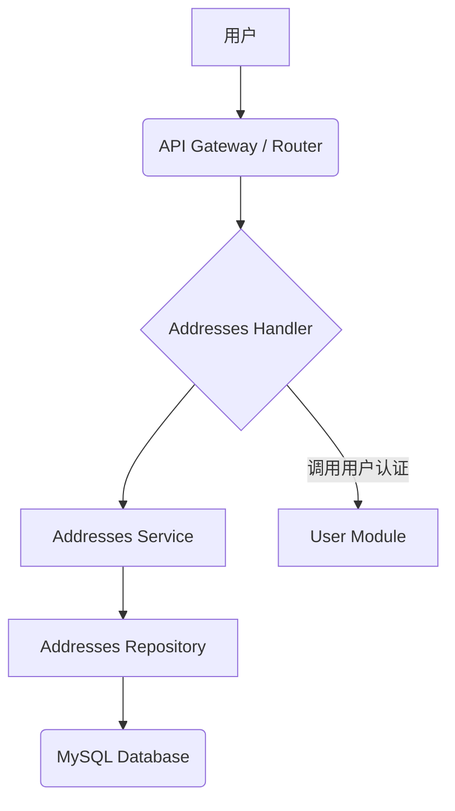

# Components

## Component List

*   **Addresses Module**
    *   **Responsibility:** 负责用户收货地址的增删改查（CRUD）业务逻辑和数据持久化。
    *   **Key Interfaces:**
        *   `addresses.Handler`: 暴露 RESTful API 接口供外部调用。
        *   `addresses.Service`: 提供业务逻辑方法供 Handler 调用。
        *   `addresses.Repository`: 提供数据访问方法供 Service 调用。
    *   **Dependencies:**
        *   `app/user` (用于用户认证和关联用户ID)
        *   `app/configs` (用于获取数据库配置)
        *   `gorm.io/gorm` (ORM 库)
        *   `github.com/gin-gonic/gin` (Web 框架)
    *   **Technology Stack:** Go, Gin, GORM, MySQL

*   **User Module** (现有模块，本次增强涉及其与 Addresses Module 的交互)
    *   **Responsibility:** 负责用户认证、用户详情管理等。
    *   **Key Interfaces:** 提供用户认证和获取用户 ID 的接口。
    *   **Dependencies:** (与 Addresses Module 无直接代码依赖，但有业务逻辑依赖)
    *   **Technology Stack:** Go, Gin, GORM, MySQL

## Component Diagrams

