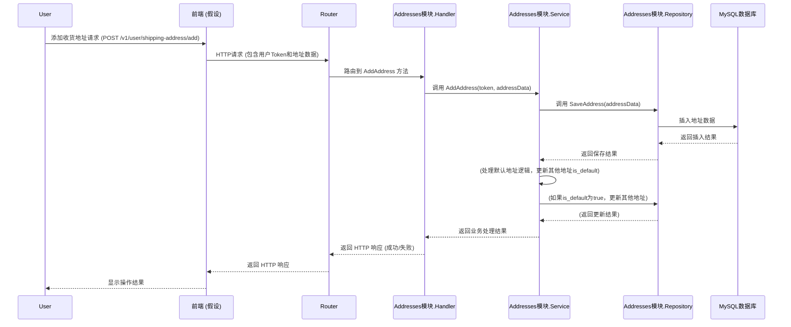

# Core Workflows

```mermaid
sequenceDiagram
    participant User
    participant Frontend as 前端 (假设)
    participant Router
    participant AddressesHandler as Addresses模块.Handler
    participant AddressesService as Addresses模块.Service
    participant AddressesRepository as Addresses模块.Repository
    participant MySQLDatabase as MySQL数据库

    User->>Frontend: 添加收货地址请求 (POST /v1/user/shipping-address/add)
    Frontend->>Router: HTTP请求 (包含用户Token和地址数据)
    Router->>AddressesHandler: 路由到 AddAddress 方法
    AddressesHandler->>AddressesService: 调用 AddAddress(token, addressData)
    AddressesService->>AddressesRepository: 调用 SaveAddress(addressData)
    AddressesRepository->>MySQLDatabase: 插入地址数据
    MySQLDatabase-->>AddressesRepository: 返回插入结果
    AddressesRepository-->>AddressesService: 返回保存结果
    AddressesService->>AddressesService: (处理默认地址逻辑，更新其他地址is_default)
    AddressesService->>AddressesRepository: (如果is_default为true，更新其他地址)
    AddressesRepository-->>AddressesService: (返回更新结果)
    AddressesService-->>AddressesHandler: 返回业务处理结果
    AddressesHandler-->>Router: 返回 HTTP 响应 (成功/失败)
    Router-->>Frontend: 返回 HTTP 响应
    Frontend-->>User: 显示操作结果
```
