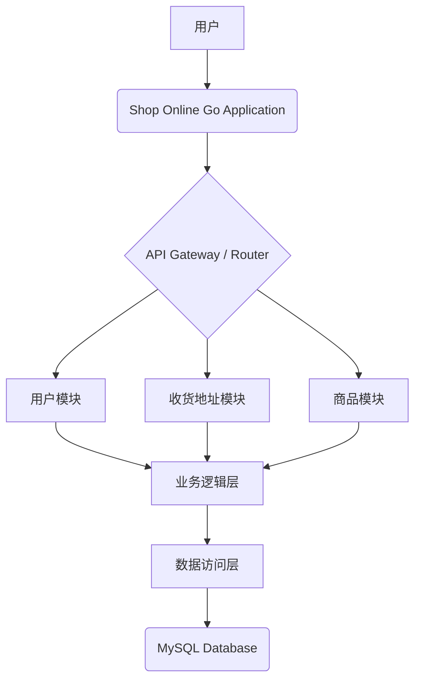

# High Level Architecture

## Technical Summary

本项目采用模块化设计的单体应用架构，基于 Go 语言和 Gin 框架构建 RESTful API 服务。核心组件包括用户管理、收货地址管理（本次增强）、商品管理等，数据通过 GORM 持久化到 MySQL 数据库。此架构旨在提供稳定高效的后端服务，支持用户收货地址的全面管理，提升用户体验。

## High Level Overview

本项目采用单体应用架构，代码组织在一个单一的仓库中。服务架构遵循三层模式：表现层（Handler）、业务逻辑层（Service）和数据访问层（Repository）。用户通过 RESTful API 与应用程序交互，请求经过路由层分发到相应的业务模块，业务逻辑层协调数据访问层与 MySQL 数据库进行数据操作。关键的架构决策包括使用 GORM 作为 ORM 工具进行数据库交互，以及使用 Migrate 进行数据库版本管理。

## High Level Project Diagram

## Architectural and Design Patterns

*   **单体应用架构 (Monolith):** 整个应用程序作为一个单一的、紧密耦合的单元进行部署。
    *   _Rationale:_ 这是现有项目的架构风格，本次增强将继续遵循此模式，以最小化对现有系统的影响。
*   **分层架构 (Layered Architecture):** 应用程序逻辑分为表现层 (Handler)、业务逻辑层 (Service) 和数据访问层 (Repository)。
    *   _Rationale:_ 这是现有项目的代码组织模式，有助于职责分离和代码可维护性。
*   **仓储模式 (Repository Pattern):** 抽象数据访问逻辑，使业务逻辑层不直接依赖于特定的数据库实现。
    *   _Rationale:_ 现有项目已采用此模式，本次增强将继续遵循，便于测试和未来可能的数据库迁移。
*   **RESTful API:** 使用标准的 HTTP 方法和资源 URI 来设计 API 接口。
    *   _Rationale:_ 这是现有项目的 API 通信模式，确保新接口与现有接口的一致性。
