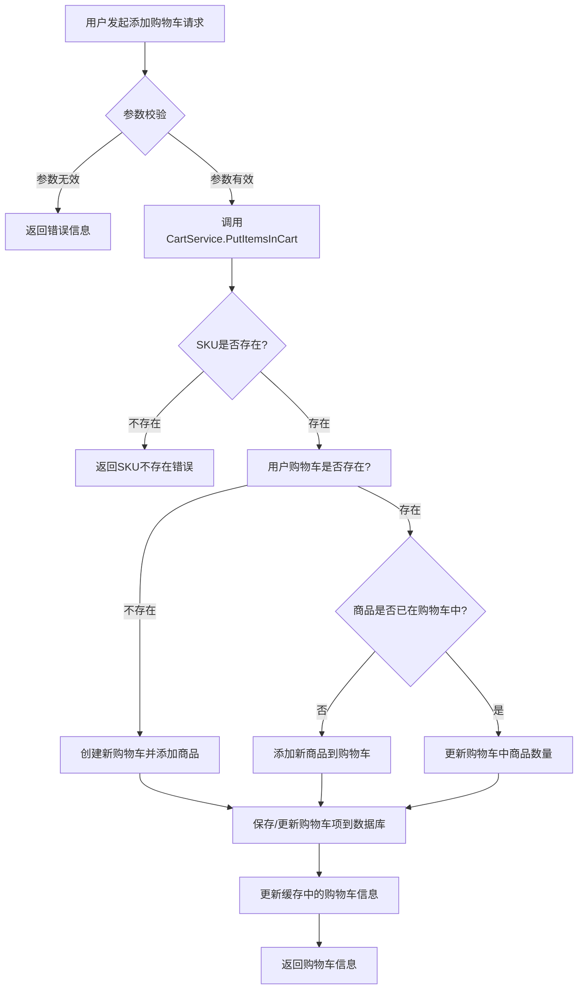
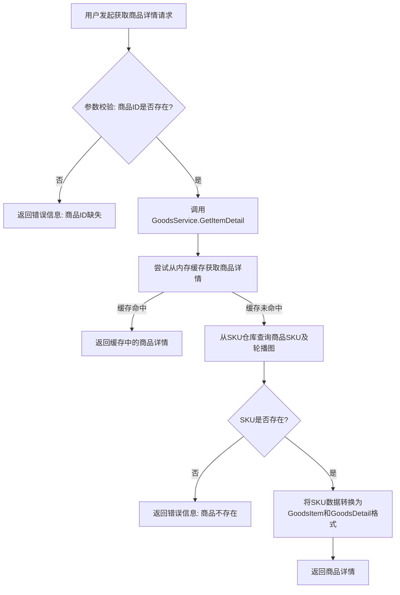
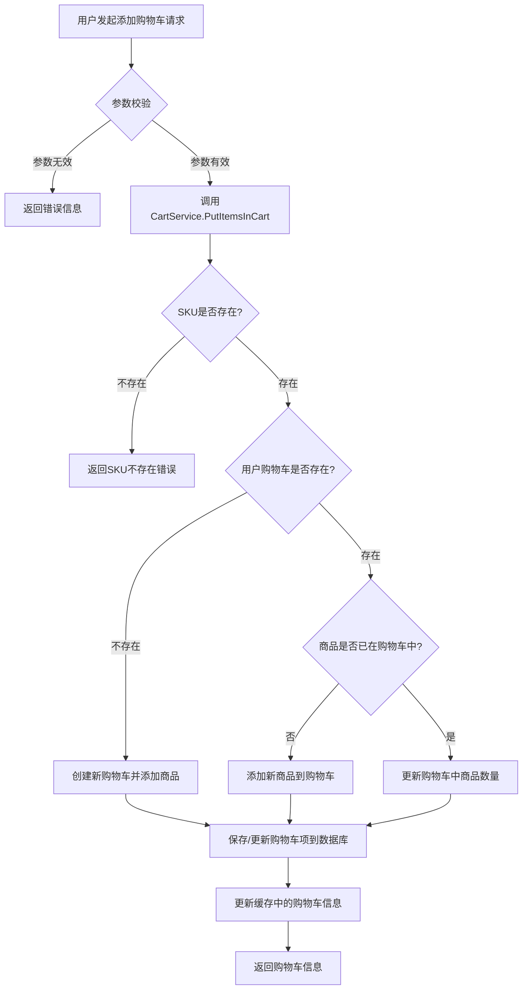

## 2. 添加商品到购物车流程

### 核心流程图

### 调用链路

**入口点**: `cart.PutIntoCart` (位于 `app/shoppingcart/cartHandler.go`)

**调用流程**:
1.  `cart.PutIntoCart` 接收HTTP POST请求，获取 `token`, `goodsId` (即 `skuId`), `number` 参数。
2.  进行基本的参数非空和类型转换校验。
3.  调用 `cart.GetCartsService().PutItemsInCart(token, skuId, quantity)`。
4.  `CartService.PutItemsInCart` 首先通过 `cs.sr.First(skuId)` 查询商品SKU详情。
5.  如果SKU不存在，则记录日志并返回 `nil`。
6.  通过 `cs.findCartInfoFor(token)` 获取当前用户的购物车信息（优先从缓存获取，若无则从数据库加载）。
7.  如果用户购物车不存在 (`ci == nil`)，则调用 `cs.CreateCartItemFor(token, sku, quantity)` 创建新购物车项并保存。
8.  如果用户购物车已存在，则通过 `ci.FindDetailBy(skuId)` 检查该商品是否已在购物车中。
9.  如果商品不在购物车中 (`item == nil`)，则调用 `cs.CreateCartItemFor(token, sku, quantity)` 添加新商品。
10. 如果商品已在购物车中，则调用 `item.AddMore(quantity)` 更新商品数量，并更新数据库中的购物车项 `cs.cr.UpdateUserCartItem`。
11. 更新购物车缓存 `cs.cached.update(token, ci)` 并重新计算红点数量 `ci.caculateRedDot()`。
12. `cart.PutIntoCart` 返回更新后的购物车信息。

### 关键判断点

| 判断点 | 条件 | 处理路径 |
|---|---|---|
| 请求参数校验 | `token`, `goodsId`, `number` 为空或 `number` 无法转换为数字 | 返回错误信息 |
| SKU是否存在 | `cs.sr.First(skuId)` 返回 `nil` | 返回SKU不存在错误 |
| 用户购物车是否存在 | `cs.findCartInfoFor(token)` 返回 `nil` | 创建新购物车并添加商品 |
| 商品是否已在购物车中 | `ci.FindDetailBy(skuId)` 返回 `nil` | 添加新商品到购物车 |

## 3. 获取商品详情流程

### 核心流程图

### 调用链路

**入口点**: `goods.GetGoodsDetail` (位于 `app/goods/goodsHandler.go`)

**调用流程**:
1.  `goods.GetGoodsDetail` 接收HTTP GET请求，获取 `id` (商品ID，即 `gid`) 参数。
2.  调用 `getItemDetail(gid)` (该函数内部会获取 `GoodsService` 实例并调用其方法)。
3.  `GoodsService` 实例通过 `gs.LoadGoods()` 加载所有商品数据到内存缓存中（如果尚未加载）。
4.  `gs.GetItemDetail(gid)` 首先尝试通过 `gs.getFromCache(gid)` 从内存缓存中查找商品详情。
5.  如果缓存命中，则直接返回缓存中的 `GoodsDetail`。
6.  如果缓存未命中，则通过 `gs.repo.FindWithCarouselPics(gid)` 从数据仓库（通常是数据库）查询对应的SKU详细信息，包括轮播图。
7.  查询到的 `SKU` 对象通过 `gs.skuToGoodsItem(*sku)` 转换为 `GoodsItem` 结构，并从中提取 `GoodsDetail` 部分。
8.  `goods.GetGoodsDetail` 返回最终的商品详情数据.

### 关键判断点

| 判断点 | 条件 | 处理路径 |
|---|---|---|
| 商品ID缺失 | 请求中 `id` 参数为空 | 返回错误信息 |
| SKU是否存在 | `gs.repo.FindWithCarouselPics(gid)` 未找到对应SKU | 返回商品不存在错误 |

### 核心流程图

### 调用链路

**入口点**: `cart.PutIntoCart` (位于 `app/shoppingcart/cartHandler.go`)

**调用流程**:
1.  `cart.PutIntoCart` 接收HTTP POST请求，获取 `token`, `goodsId` (即 `skuId`), `number` 参数。
2.  进行基本的参数非空和类型转换校验。
3.  调用 `cart.GetCartsService().PutItemsInCart(token, skuId, quantity)`。
4.  `CartService.PutItemsInCart` 首先通过 `cs.sr.First(skuId)` 查询商品SKU详情。
5.  如果SKU不存在，则记录日志并返回 `nil`。
6.  通过 `cs.findCartInfoFor(token)` 获取当前用户的购物车信息（优先从缓存获取，若无则从数据库加载）。
7.  如果用户购物车不存在 (`ci == nil`)，则调用 `cs.CreateCartItemFor(token, sku, quantity)` 创建新购物车项并保存。
8.  如果用户购物车已存在，则通过 `ci.FindDetailBy(skuId)` 检查该商品是否已在购物车中。
9.  如果商品不在购物车中 (`item == nil`)，则调用 `cs.CreateCartItemFor(token, sku, quantity)` 添加新商品。
10. 如果商品已在购物车中，则调用 `item.AddMore(quantity)` 更新商品数量，并更新数据库中的购物车项 `cs.cr.UpdateUserCartItem`。
11. 更新购物车缓存 `cs.cached.update(token, ci)` 并重新计算红点数量 `ci.caculateRedDot()`。
12. `cart.PutIntoCart` 返回更新后的购物车信息。

### 关键判断点

| 判断点 | 条件 | 处理路径 |
|---|---|---|
| 请求参数校验 | `token`, `goodsId`, `number` 为空或 `number` 无法转换为数字 | 返回错误信息 |
| SKU是否存在 | `cs.sr.First(skuId)` 返回 `nil` | 返回SKU不存在错误 |
| 用户购物车是否存在 | `cs.findCartInfoFor(token)` 返回 `nil` | 创建新购物车并添加商品 |
| 商品是否已在购物车中 | `ci.FindDetailBy(skuId)` 返回 `nil` | 添加新商品到购物车 |