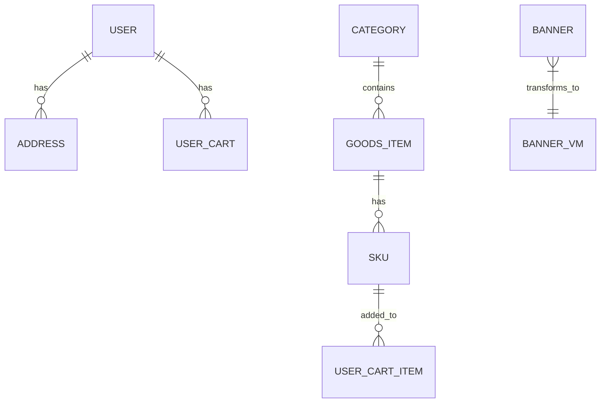

# 核心领域模型

## 领域模型概述
本项目核心领域模型主要围绕电商业务展开，包括用户、商品、购物车、订单等核心概念。

## 核心实体关系图

## 核心实体详情

### User 用户实体
| 属性名 | 类型 | 说明 |
|---|---|---|
| Id | string | 用户唯一标识 |
| Password | string | 用户密码 |
| Mobile | string | 手机号 |
| Nickname | string | 昵称 |
| AvatarUrl | string | 头像URL |
| Province | string | 省份 |
| City | string | 城市 |
| AutoLogin | uint | 是否自动登录 |
| UserInfo | string | 用户信息 |
| UserLevelId | UserType | 用户等级ID |
| UserLevel | *UserLevel | 用户等级详情 |

### Address 地址实体
| 属性名 | 类型 | 说明 |
|---|---|---|
| Id | string | 地址唯一标识 |
| LinkMan | string | 联系人 |
| Mobile | string | 手机号 |
| IsDefault | bool | 是否默认地址 |
| ProvinceStr | string | 省份 |
| CityStr | string | 城市 |
| AreaStr | string | 区域 |
| DetailAddress | string | 详细地址 |

### Banner 广告实体
| 属性名 | 类型 | 说明 |
|---|---|---|
| BusinessId | uint | 业务ID |
| DateAdd | string | 添加日期 |
| Id | uint | 广告ID |
| LinkUrl | string | 跳转链接 |
| Paixu | uint | 排序 |
| PicUrl | string | 图片URL |
| Remark | string | 备注 |
| Status | uint | 状态 |
| StatusStr | string | 状态描述 |
| Title | string | 标题 |
| Catelogue | string | 类型 |
| UserId | uint | 用户ID |

### Book 书籍实体 (示例，可能为商品的一种特殊类型)
| 属性名 | 类型 | 说明 |
|---|---|---|
| ID | int | 书籍唯一标识 |
| Title | string | 书籍标题 |
| Author | string | 作者 |

### Category 商品分类实体
| 属性名 | 类型 | 说明 |
|---|---|---|
| Id | uint | 分类ID |
| Name | string | 分类名称 |

### GoodsItem 商品项实体
| 属性名 | 类型 | 说明 |
|---|---|---|
| Gid | string | 商品序号ID |
| Name | string | 商品名称 |
| CategoryId | uint | 分类ID |
| RecommendStatus | string | 推荐状态 |
| PicUrl | string | 图片URL |
| MinPrice | string | 最低价格 |
| OriginalPrice | string | 原始价格 |
| GoodsDetail | GoodsDetail | 商品详情 |

### SKU 库存量单位实体
| 属性名 | 类型 | 说明 |
|---|---|---|
| SkuId | string | SKU唯一标识 |
| Name | string | SKU名称 |
| CategoryId | uint | 分类ID |
| RecommendStatus | string | 推荐状态 |
| PicStr | string | 图片字符串 |
| Unit | string | 数量单位 |
| Stock | uint | 库存 |
| MinPrice | string | 最低价格 |
| OriginalPrice | string | 原始价格 |
| Logistics | string | 是否包邮 |
| Content | string | 商品介绍 |
| Status | SalingStatus | 销售状态 |
| Aftersale | AfterSaleType | 售后类型 |
| SkuCarouPictures | []SkuCarouPicture | SKU轮播图 |

### UserCartItem 用户购物车项实体
| 属性名 | 类型 | 说明 |
|---|---|---|
| Token | string | 用户Token |
| SkuId | string | SKU ID |
| Pic | string | 图片URL |
| Status | uint | 状态 (1: 失效) |
| Name | string | 名称 |
| SkuStrs | string | SKU字符串 |
| Price | string | 价格 |
| Quantity | uint | 数量 |
| Selected | string | 是否选中 |
| OptionValueName | string | 选项值名称 |
