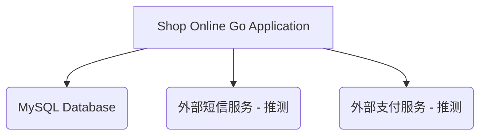

# 外部依赖与下游服务

本项目依赖于多个外部库和下游服务，以提供完整的功能。以下是主要的外部依赖及其用途。

## 1. 外部库依赖

### Go Modules (通过 `go.mod` 文件)

- **`github.com/gin-gonic/gin`**: Go语言高性能HTTP Web框架，用于构建RESTful API。
- **`github.com/spf13/viper`**: 灵活的Go配置解决方案，用于读取和管理应用程序的配置。
- **`gorm.io/driver/mysql`** 和 **`gorm.io/gorm`**: Go语言的ORM库，用于简化与MySQL数据库的交互，提供对象关系映射功能。
- **`github.com/go-sql-driver/mysql`**: MySQL数据库驱动，GORM底层使用。
- **`github.com/golang-migrate/migrate/v4`**: 数据库迁移工具，用于管理数据库的版本和结构变更。
- **`github.com/afocus/captcha`**: 用于生成图形验证码。
- **`github.com/rs/xid`**: 用于生成全局唯一的ID。

## 2. 下游服务概述

### MySQL 数据库

- **用途**: 作为主要的持久化存储，用于存储用户数据、商品信息、订单数据、购物车数据等所有业务相关数据。
- **连接配置**: 数据库连接信息（如用户名、密码、地址、端口、数据库名）通过 `config.yaml` 文件配置，并在 `app/configs/cfg.go` 中进行加载和管理。
- **调用方式**: 通过GORM库进行数据操作。

## 3. 调用关系图

**说明**: 
- `MySQL Database` 是项目明确依赖的数据库服务。
- `外部短信服务` 和 `外部支付服务` 是根据电商业务的常见需求推测的潜在下游服务，尽管当前代码中未直接体现明确的调用接口，但在实际业务流程中通常会涉及。
